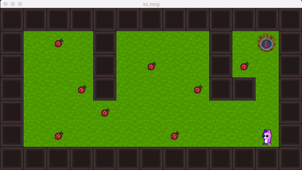

# 42-so_long
[](https://github.com/JaeSeoKim/badge42)

***Description:***

A simple 2d game where the player must collect all the coins and exit the map.
- W, A, S, and D keys to move the character.
- ESC closes the window and quits the program.
- the program takes a map description file with the .ber extension as argument.
  - The map must be composed of only 5 possible characters: 0 for an empty space, 1 for a wall, C for a collectible, E for map exit and P for the player’s starting position.
  - The map must be closed/surrounded by walls.
  - Map must have at least one collectable, one exit, and one starting position.
  - Map must be rectangular.

***Objectives:***
- Applicative

***Skills:***
- Graphics
- Imperative programming

***Usage:***
```
git clone
make all
./so_long "maps/validmap.ber"
```
***Preview:***


